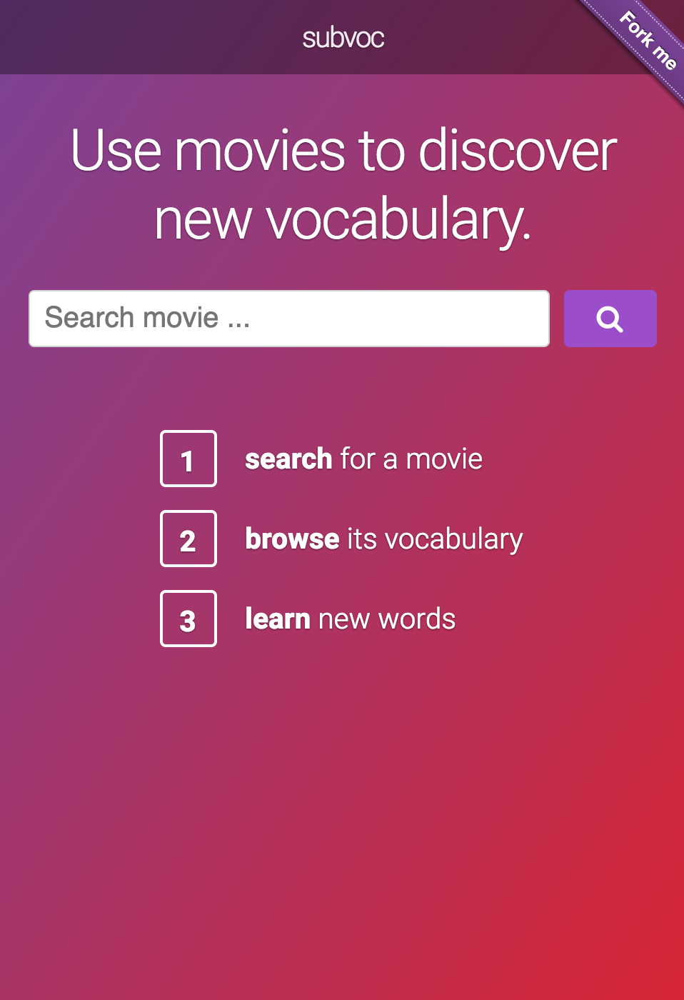
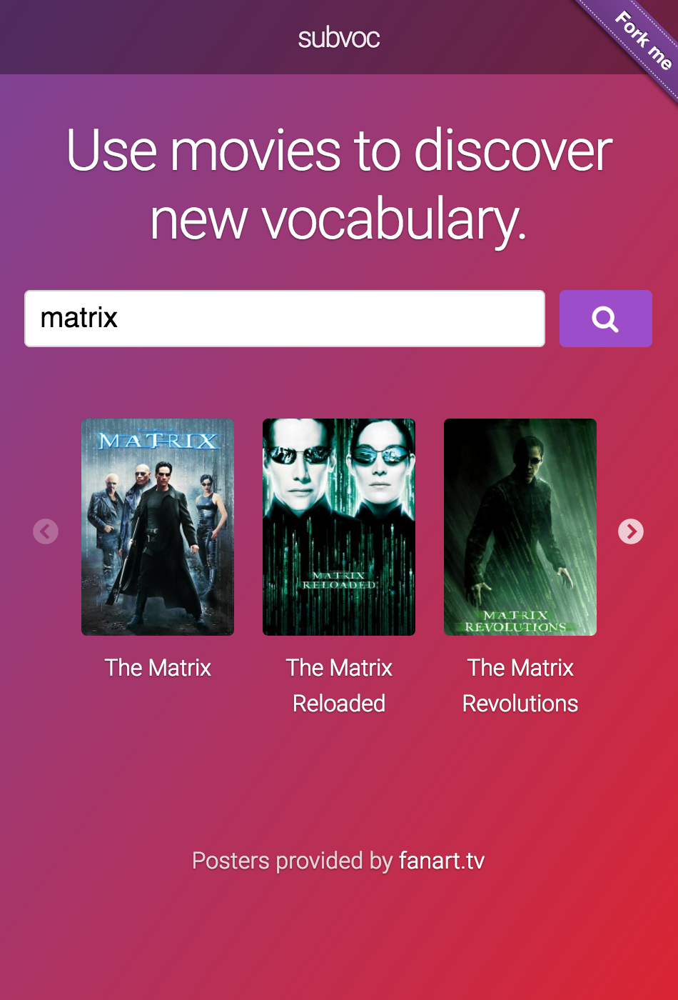
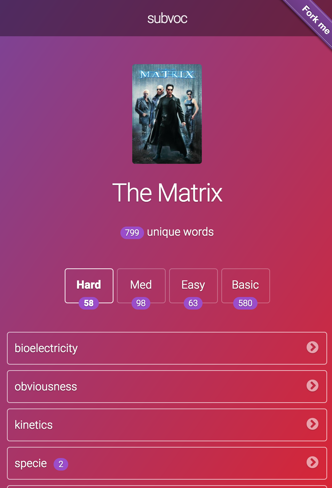
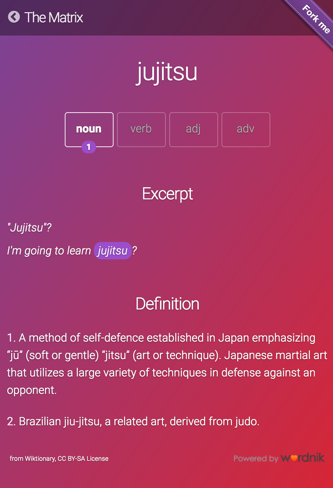

subvoc  
======

This project was created by me to scratch my own itch.
I love to watch movies and am always keen to expand my vocabulary.
But it's difficult to notice an unknown word *during* a movie without spoiling the experience.
That's where `subvoc` comes in: search for a movie and discover its vocabulary.

## Online Demo

Visit https://subvoc.stephanbehnke.com (hosted on Heroku, takes a few moments to start sometimes).

NOTE: The external API can be flaky - you can search for 'Se7en' (be exact) to use a cached movie in this case.

To get a very quick impression, here are some screenshots:

Homepage                       | Find Movie                | List of words             | Word details
:-----------------------------:|:-------------------------:|:-------------------------:|:-------------------------:
 |  |  | 

## How it works

When you select a movie, the [OpenSubtitles API](http://trac.opensubtitles.org/projects/opensubtitles/wiki/XMLRPC) is queried for its subtitles. Then, the result is parsed, tokenized and analyzed sentence by sentence, word by word with the help of the [Python Natural Language Toolkit](http://www.nltk.org). The difficulty of a word is determined by its relative frequency in the English language, assuming that more difficult words are simply used less.

## Features

 - [x] landing page with search bar
 - [x] search movie by query
 - [x] sort search results by popularity
 - [x] host on Heroku
 - [x] list of words sorted by difficulty
 - [x] use the base of each word
 - [x] lazy load analysis
 - [x] show movie context for each word
 - [x] include movie poster
 - [ ] support for idioms
 - [ ] support for TV show episodes
 - [ ] show context in another language side by side
 - [ ] wild idea: display YouTube videos with a certain word

## Development

 - `pip install -r requirements.txt`
 - `pip install -r dev-requirements.txt`
 - `python -m nltk.downloader $(tr "\n" " " < ".nltk_packages")`
 - use `python run.py`, `pytest` and `scripts/compilejs.sh`

Start the application via `python run.py`, test it via `pytest`.

## License
MIT (see LICENSE).
